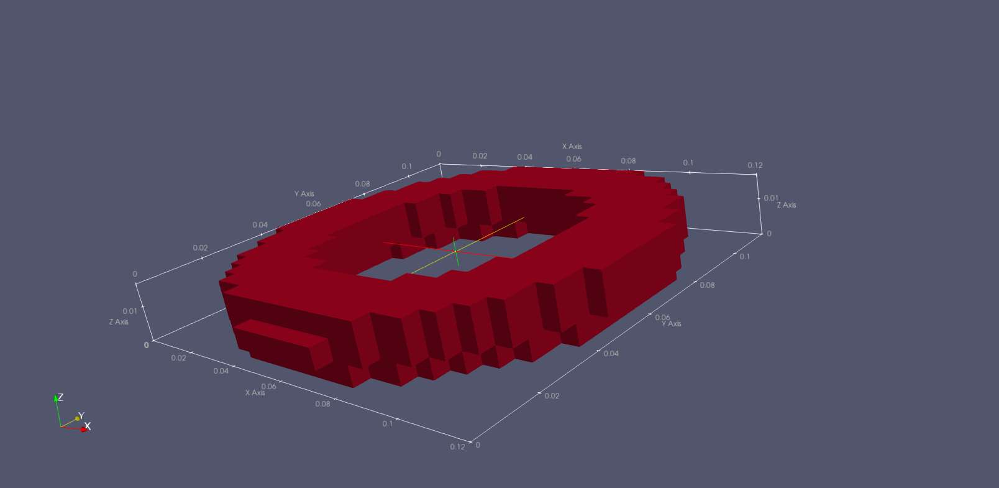
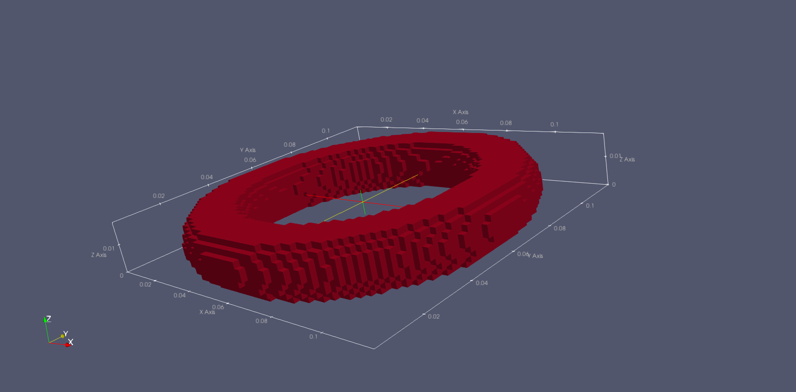
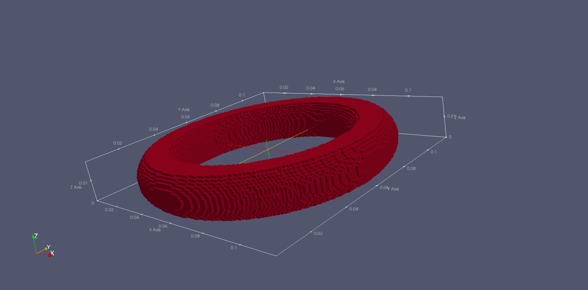

# stl-to-hdf5-gprMax
## Requirements
This program uses the Python 3 dependencie pyvoxsurf, which is only compatible with Microsoft Windows.
* Python 3
* Microsoft Windows SO
## Installation
Extract and run
```
pip install -r requirements.txt
```
## Usage
First of all, you have to create **n-1** folders named from **0** to **n-1**. Where **n** is the ammount of materials your model has. Every part of the model in the same folder will be interpreted in gprMax as the same material.
Using python 3, run the following
```
python stl_to_hdf5.py <dx_dy_dz-in-mm> <optional-reflect>
```
For example, for transforming a stl file in h5 with resolution of 0.5mm, run
```
python stl_to_hdf5.py 0.5
```
## Results
The example files on this repository displayed in [paraview](https://www.paraview.org/download/).


