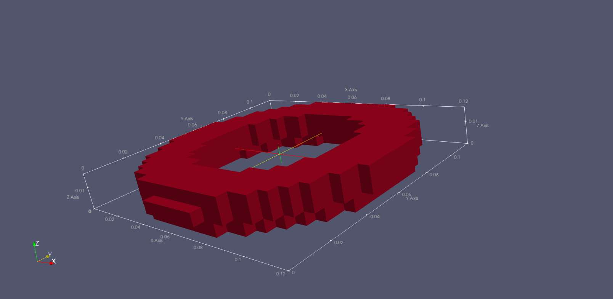
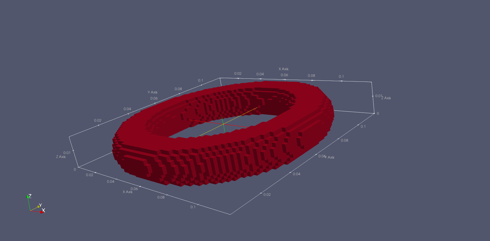
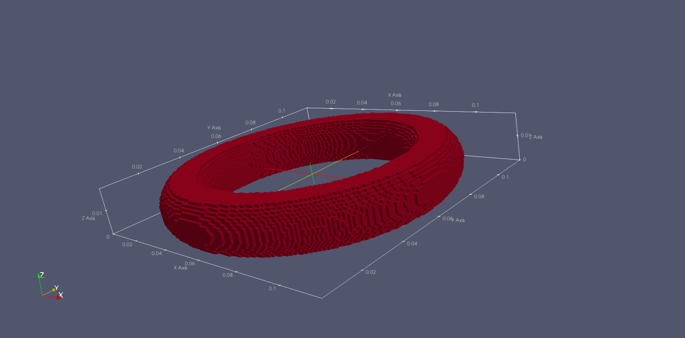
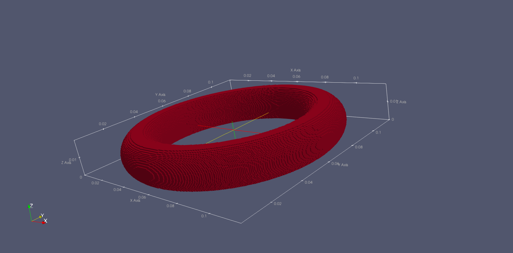

# stl-to-hdf5-gprMax
## Requirements
This program uses the Python 3 dependencie [stl-to-voxel](https://github.com/cpederkoff/stl-to-voxel).
* Python 3
## Installation
Extract and run
```
pip install -r requirements.txt
```
## Usage
Using Python 3, run the following
```
python stl_to_hdf5.py input-stl-file.stl -r <resolution-in-mm> -n <.h5 output file name>
```
You can use multiple input stl files.
```
python stl_to_hdf5.py input-stl-file1.stl input-stl-file2.stl input-stl-file3.stl -r <resolution-in-mm> -n <.h5 output file name>
```
For example, for transforming a stl file in h5 with resolution of 0.5mm, run
```
python stl_to_hdf5.py Toro.stl -r 0.5 -n toro_5mm
```
## Results
The example files on this repository displayed in [paraview](https://www.paraview.org/download/).
| Resolution | 3D View |
| ------------- | ------------- |
| 5.0 mm  |   |
| 2.0 mm  |   |
| 1.0 mm  |   |
| 0.5 mm  |   |
